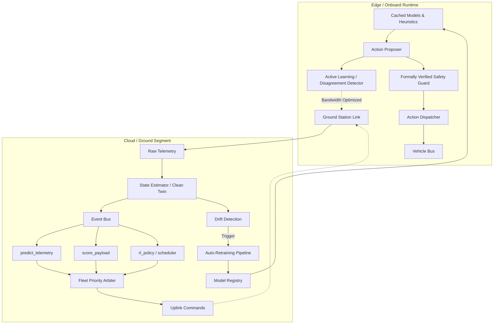

# ASTRA — Target Satellite Decision Engine Architecture

This document sketches the target architecture for ASTRA, an autonomous satellite decision engine. Its proposed machine-learning proposal layer and formally verified safety layer are not yet implemented. The current codebase contains a simulator, a rule-based heuristic, and a Gymnasium environment; see the root README for implementation status.

## 1. Design Principles

1. **AI proposes, rules dispose.** No learned model ever actuates directly. Every action passes through a deterministic safety layer before it touches the vehicle.
2. **Graceful degradation over graceful failure.** If a model is slow, unavailable, or low-confidence, the system falls back to a cheap heuristic — never to "do nothing" or "crash."
3. **Train where it's safe, deploy where it's fast.** All learning happens in the cloud/ground segment against a simulator. Onboard/edge only runs inference, and only on models that have passed shadow-mode validation.
4. **Two priority axes, not one.** What gets decided about (payload priority) is a separate concern from which functions get to run (function priority, i.e., a compute/latency budget).
5. **Formal Verification over Unit Tests.** The final safety guard must be mathematically proven to respect state invariants (e.g., via TLA+).
6. **Everything is observable.** Every decision — model or rule — is logged with its inputs, its confidence, and which component made it.

---

## 2. System Overview

The system is split into the **Cloud/Ground Segment** (heavy lifting, state estimation, multi-agent fleet arbitration, and retraining) and the **Edge/Onboard Runtime** (execution, deterministic safety, and action caching).



---

## 3. Cloud / Ground Segment

### 3.1 State Estimation ("Clean Twin" vs "Dirty Twin")
Telemetry from orbit is noisy, delayed, or blacked out between ground station passes.
* **Dirty Twin:** The raw, delayed telemetry stream.
* **Clean Twin:** An Extended Kalman Filter (EKF) or Particle Filter processing the Dirty Twin to provide the statistically most likely *current* state of the vehicle, projecting through blackouts. FaaS functions operate exclusively on the Clean Twin.

### 3.2 Event Bus & Triggers
Trigger on events, let a scheduler batch periodic ones. The bus carries a compact JSON payload (state snapshot + delta). Functions pull history from a feature store if needed.

* `orbit.tick` → `predict_telemetry`, `priority_rank`
* `payload.created` → `score_payload`
* `gs_pass.start` / `gs_pass.end` → `downlink_scheduler`
* `threshold.crossed` → Fast-track to `priority_rank` or `safety_guard`

### 3.3 Decision Functions (FaaS)
Each function is independently deployable, versioned, and prioritized.

* **`score_payload`**: CNN inference (cloud-cover %, target detection) on thumbnails. Replaces synthetic values with learned estimates.
* **`predict_telemetry`**: Short-horizon forecast (N = 30–120s ahead). Turns the system from reactive to proactive (throttle activity *before* hitting the floor).
* **`rl_policy`**: Trained offline, served via a lightweight endpoint. Outputs parameterized actions (e.g., `Process Payload X starting at T+10s for 45s`).
* **`priority_rank` (Fleet Arbiter)**: Merges payload priority and function priority across *multiple satellites*, handling Inter-Satellite Link (ISL) routing and contention for ground stations.

### 3.4 Digital Twin Training Pipeline
The Digital Twin (`satellite_sim.py`) is wrapped as a `gym.Env` for RL training.
* **Action Space:** Parameterized Multi-Discrete (Payload ID × Action Type × Time Offset).
* **Reward:** `downlinked_utility` − `w1·involuntary_drops` − `w2·safe_mode_ticks`. 
* **Domain Randomization:** Randomize GS passes, payload arrivals, and thermal noise to prevent memorization.

---

## 4. The Priority Engine

### 4.1 Payload Priority (What to act on)
```text
priority(payload) = (w_value * CNN_score) 
                  + (w_fresh * freshness_decay(t)) 
                  - (w_cloud * cloud_cover)
                  + (w_mission * mission_tag_boost)
```

### 4.2 Function Priority (What gets to run)
Under compute/power budgets, not every function runs every tick.
* **`safety_guard`**: Always runs synchronously. No fallback.
* **`predict_telemetry`**: High priority. Degrades to linear extrapolation.
* **`rl_policy`**: Medium priority. Degrades to `heuristic_agent` if confidence is low.
* **`score_payload`**: Medium priority. Degrades to raw synthetic values.

---

## 5. Edge / Onboard Runtime

Kept deliberately minimal to ensure absolute reliability.

1. **Local Cache:** Stores last-known-good quantized models (ONNX/TFLite) and the deterministic heuristic fallback.
2. **Formally Verified Safety Guard:** Identical to the cloud version, but verified via TLA+ model checking to prove it can *never* violate critical thresholds (e.g., Battery min-DOD). Never trust a network round-trip for this.
3. **Action Dispatcher:** Executes approved actions against the vehicle bus.
4. **Active Learning Sync:** To save massive bandwidth, the edge does *not* sync every telemetry log. It runs the RL agent and the Heuristic agent in shadow mode, and **only downlinks the log if the two models violently disagree**, or if a critical thermal/power spike occurs (Hard Negative Mining).

---

## 6. Observability, MLOps, and Continuous Training (CT)

* **Decision Trace Log:** Every action records which function proposed it, its confidence, the safety guard's veto/approval, and the final outcome.
* **Continuous Training (CT) Loop:** 
  1. Drift Detection flags if current thermal/power dynamics deviate >5% from the training distribution.
  2. The Auto-Retraining pipeline pulls the last 30 days of telemetry, retrains the forecasting models, and evaluates them.
  3. If accuracy improves, the model is automatically promoted to Cloud Shadow Mode.
* **Rollback:** Keep the last N production versions cached at the edge so rollback is a pointer flip, not a redeploy.

---

## 7. Suggested Tech Stack

| Layer | AWS-Flavored | Open-Source / Self-Hosted |
| :--- | :--- | :--- |
| **Event Bus** | EventBridge + SQS | Kafka / NATS |
| **FaaS Runtime** | Lambda + Step Functions | OpenFaaS / Knative |
| **Model Serving** | SageMaker Endpoints | Ray Serve / Triton / ONNX |
| **RL Training** | SageMaker RL | Ray RLlib / Stable-Baselines3 |
| **Model Registry** | SageMaker Model Registry | MLflow |
| **Telemetry Store** | Timestream / S3+Parquet | TimescaleDB / Parquet on disk |
| **Dashboards** | CloudWatch + Grafana | Grafana + Prometheus |

---

## 8. Failure Modes & Fallbacks

| Failure | Detection | Fallback |
| :--- | :--- | :--- |
| **RL model timeout** | Health check / latency > 50ms | `heuristic_agent` |
| **CNN confidence low** | Confidence < threshold | Cached / synthetic value score |
| **Forecast model stale** | Timestamp too old | Linear extrapolation |
| **Safety guard clash** | Veto rate spikes | Alert + auto-freeze model promotions |
| **GS-pass blackout** | No uplink for N passes | Edge runs entirely on cached models |

---

## 9. Phased Rollout

* **Phase 0 — Instrumentation:** Add the decision-trace logging schema to the existing `heuristic_agent`. This provides a baseline and generates real training data from day one.
* **Phase 1 — Forecasting:** Ship `predict_telemetry`, keep everything else heuristic. Immediate proactive safety benefits.
* **Phase 2 — Payload Scoring:** Replace synthetic values with CNN learned scores. Shadow-validate against operator ground-truth.
* **Phase 3 — RL Policy:** Train against the gym simulator, shadow extensively, canary at low traffic %, and promote.
* **Phase 4 — Fleet Scale:** Introduce the multi-agent Fleet Arbiter for ISL routing and GS bandwidth contention. 
