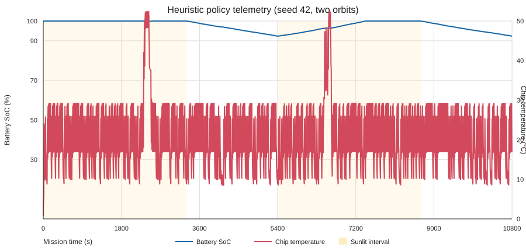

# ASTRA: Adaptive Satellite Task and Resource Allocator for LEO Earth Observation

*IASTAM 6.0 Technical Challenge — Track 1: Artificial Intelligence and Onboard Computing (Problem 1)*

**Mohamed Habib Abid¹\*, Mariam Neffeti²\***

¹ ISI El Manar (Higher Institute of Computer Science), Tunisia

² INSAT (National Institute of Applied Science and Technology), Tunisia

*Team: Charmoula wMa9rou4*

*Track 1 — Artificial Intelligence and Onboard Computing*

*Problem 1 — “Process or Transmit?”*

*Emails: mohamedhabib.abid@etudiant-isi.utm.tn, mariam.neffeti@insat.ucar.tn*

*(\*Equal contribution)*

---

### Abstract
Small Earth-observation (EO) satellites produce multispectral and synthetic-aperture-radar (SAR) payloads under intermittent ground contact and constrained battery, storage, compute, and thermal resources. We present ASTRA (Adaptive Satellite Task and Resource Allocator), a research prototype for IASTAM 6.0's "Process or Transmit?" challenge. In the current simulator, we compare transmit-all, greedy-edge processing, a threshold heuristic, and one MaskablePPO policy. We evaluate each over five paired held-out scenarios of four 90-minute orbits, using decision quality, task completion, energy, latency, memory occupancy, single-event-upset (SEU), and safe-mode metrics. The threshold heuristic attains a mean delivered-utility ratio of 0.0286 and task completion rate of 1.60%; greedy-edge completes 5.17% of generated payloads but attains a utility ratio of 0.00470. The single-seed PPO checkpoint delivers no tasks; its 206.0 kJ mean energy use is below the processing-heavy policies but above transmit-all, consistent with an inactive-but-not-idle policy rather than an efficiency gain. This result is diagnostic rather than a candidate operational policy and motivates the reward and training-time investigation in Section IV-B. A separate two-orbit trace reaches 52.48 degrees Celsius despite a 50-degree compute-throttling threshold. These synthetic results are preliminary; the thermal threshold is not a hard safety cap, and PPO was trained only briefly. We provide reproducible code and episode-level outputs; Lyapunov and oracle evaluations remain future work.

***Keywords—***orbital edge computing; satellite task scheduling; reinforcement learning; constrained optimization; Low Earth Orbit.

---

## I. INTRODUCTION

The IASTAM 6.0 Technical Challenge, organized by IEEE IAS Tunisia with TUNSA, asks how an Earth-observation satellite should handle payloads under intermittent ground contact and onboard resource limits. Orbital edge computing concepts motivate processing selected data near the sensor [1], [8].

Within this domain, Problem 1 ("Process or Transmit?") targets an acute bottleneck in Earth Observation (EO): small satellites continuously capture high-resolution optical and Synthetic Aperture Radar (SAR) payloads (generating multi-megabyte payloads every $15\text{ s}$), yet operate under three binding physical constraints:
1. **Electrochemical Battery Degradation Floor:** The current simulator models a $100\text{ Wh}$ battery with a 30% minimum depth-of-discharge floor.
2. **Thermal Constraint:** The physical system requires radiative heat rejection in vacuum. The current simulator uses a first-order thermal proxy and throttles compute at 50$^\circ$C, but this is not a hard temperature limit; a measured trajectory reaches 52.48$^\circ$C.
3. **Severe Downlink Bandwidth Choke:** Line-of-sight contact with ground stations is limited to short windows ($120\text{--}180\text{ s}$ per 90-minute orbit, about 2.8% mean contact duty cycle) with an X-band rate of $20.0\text{ Mbps}$ ($2.5\text{ MB/s}$).

For every captured payload, the onboard system must choose among four actions: `PROCESS_NOW` (compression vs. inference), `STORE_QUEUE` (time-shifted execution in Mass Memory Unit, MMU), `TRANSMIT_RAW` (downlink during line-of-sight passes), or `DISCARD_DROP` (pruning low-utility or cloud-occluded data). The optimization objective is to maximize cumulative scientific and operational utility, which decays exponentially over latency.

**Contributions:**
* **Simulator Characterization:** We evaluate the existing one-second LEO simulator, including solar profile, battery floor, simplified thermal dynamics, queueing, and stochastic SEU recovery.
* **Paired Policy Comparison:** We implement and compare transmit-all, greedy-edge, the existing threshold heuristic, and an initial MaskablePPO agent on common simulator seeds.
* **Reproducible Evaluation:** We report eight outcome/resource metrics with per-policy uncertainty and paired differences over five four-orbit episodes.
* **Limitations:** The single-seed PPO policy completes no tasks; Lyapunov and oracle comparisons, thermal calibration, and flight validation remain future work.

---

## II. RELATED WORK

### A. Orbital and Edge Computing Systems
Orbital edge computing work describes the potential for processing data near the sensor [1]. Trabant proposes a serverless architecture for multi-tenant orbital computing [2], while the Tiansuan BUPT-1 study reports a cloud-native satellite case study [3]. Broader surveys discuss AI in space [4] and onboard Earth-observation image processing [5]. FPGA accelerator research [6] and compute-placement analysis [7] provide context for the design space. The numerical workload, energy, and thermal parameters used here are simulator assumptions; they are not calibrated or copied as empirical operating points from these studies.

### B. Control and Scheduling Paradigms
Resource-constrained orbital scheduling is addressed via two dominant paradigms:
1. **Lyapunov Optimization & Drift-Plus-Penalty:** Prior work [10] motivates an online scheduling approach; implementing and evaluating an orbital scheduler remains planned work.
2. **Constrained Reinforcement Learning (CMDP):** We train an initial MaskablePPO policy with the repository's Gymnasium environment and invalid-action masks; its single-seed result is exploratory.

### C. Added Value of This Work
Prior work motivates orbital edge processing and constrained scheduling. This interim study provides a reproducible comparison of two operational reference policies, the threshold heuristic, and one exploratory learned policy, while identifying model and learning gaps.

---

## III. METHODOLOGY

### A. Physical Models & Orbital Mechanics

The satellite orbital environment and hardware state at time $t$ are formalized in Table I.

**TABLE I: Primary System & State Variables**

| Symbol | Physical Definition | Nominal Value / Range |
| :--- | :--- | :--- |
| $\tau_{\text{orbit}}, \tau_{\text{sun}}$ | Orbit period / Sunlit duration | $5400\text{ s}$ (90 min) / $3300\text{ s}$ (55 min) |
| $P_{\text{harvest}}(t)$ | Solar power harvested | $0.0\text{ W}$ (eclipse) to $30.0\text{ W}$ peak ($22.5 \pm 7.5\text{ W}$) |
| $\text{SoC}(t)$ | Battery State-of-Charge | Floor: $\text{SoC} \ge 0.30$, Capacity: $100.0\text{ Wh}$ ($360\text{ kJ}$) |
| $T_{\text{chip}}(t)$ | Lumped simulated chip temperature | Ambient: $0^\circ\text{C}$; throttling threshold: $50^\circ\text{C}$ |
| $G(t)$ | Ground station line-of-sight flag | $\{0, 1\}$, randomized contact: $120\text{--}180\text{ s}$ per orbit (about 2.8\% mean duty) |
| $B_{\text{downlink}}$ | RF downlink communication speed | $20.0\text{ Mbps} = 2.5\text{ MB/s}$ ($15.0\text{ W}$ RF power) |
| $p_{\text{seu}}$ | Per-second simulated SEU event probability | $10^{-5}$ (Bernoulli RAM-reset event) |
| $M_{\text{mmu}}, M_{\text{ram}}$ | Mass Memory Unit / RAM capacity | $32\,000\text{ MB}$ ($32\text{ GB}$) / $4\,000\text{ MB}$ ($4\text{ GB}$) |

The SEU model draws a Bernoulli event each second with probability $10^{-5}$. An event wipes volatile RAM, resets accelerator state, and returns queued work to MMU for recovery; the simulator does not inject bit-level payload corruption.

#### 1) Power & Electrochemical Battery Dynamics
The simulator uses a 55-minute sunlit interval followed by a 35-minute eclipse. During sunlight, harvested power follows a sine-shaped profile between a 22.5 W base and a 30 W peak, with 30 s cosine tapers at sunlight boundaries; harvested power is zero in eclipse.

Net power balance integrates directly into battery energy $E_{\text{batt}}(t)$:
$$E_{\text{batt}}(t+1) = \min\left(E_{\text{cap}}, E_{\text{batt}}(t) + [P_{\text{harvest}}(t)-P_{\text{draw}}(t)]\Delta t\right)$$
where $P_{\text{draw}}(t)=P_{\text{base}}+P_{\text{compute}}(t)+P_{\text{comm}}(t)$, $P_{\text{base}}=5.0$ W, and radio power is 15.0 W when transmitting. The code applies no charge/discharge efficiency. Battery energy is clamped at the 30% depth-of-discharge floor on brownout; safe mode exits above 1.05 times the floor.

#### 2) Lumped Thermal Proxy
The current simulator uses a lumped first-order thermal proxy, not a Stefan--Boltzmann radiation model:
$$T_{\text{chip}}(t+1)=T_{\text{chip}}(t)+0.15P_{\text{draw}}(t)-0.10(T_{\text{chip}}(t)-T_{\text{amb}})$$
with one-second steps, $T_{\text{amb}}=0^\circ$C, and total bus, compute, and communication draw in watts. Compute is paused while temperature is at or above 50$^\circ$C. This threshold triggers throttling but is not a hard temperature cap: the seed-42 two-orbit trace reaches 52.48$^\circ$C.

### B. Workload, Queueing, and Utility Formulation

Payloads $k$ arrive periodically every $\Delta t_{\text{gen}} = 15\text{ s}$ across dual modalities:
* **Optical Multispectral ($70\%$):** Size $S_k \in [5, 15]\text{ MB}$, initial scientific utility $U_{0,k} \in [10, 100]$.
* **Synthetic Aperture Radar ($30\%$):** Size $S_k \in [100, 300]\text{ MB}$, initial scientific utility $U_{0,k} \in [10, 100]$.

Each payload's value decays exponentially over latency $(t - t_{\text{capture}})$:
$$U_k(t) = U_{0,k} \cdot \exp\left(-\alpha_k (t - t_{\text{capture}})\right)$$
with decay parameter $\alpha_k \in [10^{-4}, 10^{-3}]\text{ s}^{-1}$.

Compute actions transform payload properties:
* **Compression:** Duration $\Delta t_{\text{comp}} = 2\text{ s}$, power $P_{\text{comp}} = 10\text{ W}$, size reduction factor $C_{\text{ratio}} = 0.30$, utility retention $\rho_{\text{val}} = 0.90$.
* **Inference (Feature Extraction):** Duration $\Delta t_{\text{inf}} = 5\text{ s}$ (with $2\text{ s}$ wake-up penalty), power $P_{\text{inf}} = 20\text{ W}$ ($30\text{ W}$ wake), size reduction factor $C_{\text{ratio}} = 0.001$, utility retention $\rho_{\text{val}} = 0.50$.

---

### C. Decision Engine & Solution Schedulers

For each payload $k$ in mass memory, the agent selects an action $a_k \in \{\text{PROCESS\_COMPRESS}, \text{PROCESS\_INFER}, \text{DOWNLINK\_RAW}, \text{STORE\_QUEUE}, \text{DISCARD\_DROP}\}$:

```
                          ┌───────────────────────────┐
                          │   Incoming Sensor Frame   │
                          └─────────────┬─────────────┘
                                        │
                                        ▼
                          ┌───────────────────────────┐
                          │  Mass Memory Buffer (MMU) │
                          └─────────────┬─────────────┘
                                        │
               ┌────────────────────────┴────────────────────────┐
               ▼                                                 ▼
      [In Ground Contact?]                             [Out of Ground Contact]
      ├── Yes: Downlink Raw or                          ├── High Power/Cool: Process Onboard
      │        Downlink Pre-Processed                   │   (Inference or Compression)
      └── No:  Hold in MMU Queue                        ├── Eclipse/Hot: Buffer in Queue
                                                        └── Storage Full: Discard Lowest Value
```

1. **Transmit-all:** Sends the oldest raw MMU payload during each ground-station contact; performs no onboard processing or voluntary drops.
2. **Greedy-edge:** Processes the oldest eligible payload whenever a processing-queue slot is available, then downlinks processed outputs during contact.
3. **Threshold heuristic:** Uses contact-aware downlink, SoC/temperature-gated processing, and stale-data drops under storage pressure.
4. **MaskablePPO:** Acts on normalized telemetry and top-$K$ payload metadata with invalid-action masks. This initial learned policy is exploratory, not tuned or safety-certified.
5. **Planned methods:** Lyapunov drift-plus-penalty scheduling and a non-causal MILP oracle remain unimplemented.

---

## IV. EXPERIMENTS AND RESULTS

### A. Experimental Setup & Validation

We compare four policies with the same `SimConfig`, simulator, four-orbit horizon (21,600 one-second steps), and five paired evaluation seeds (1001--1005). The heuristic is the paired reference. PPO training uses seed 7 and 100,000 requested timesteps; evaluation seeds are disjoint from training. Results are episode means, sample standard deviations, and two-sided 95% Student-t intervals ($n=5$, 4 degrees of freedom). Decision quality divides delivered utility by the snapshot sum of generated payload base values. Utilization is time-averaged occupancy; energy includes modeled base, compute, and communication draw; latency averages completed deliveries only. PPO uses a single training seed, so its results do not estimate training-seed variability.

### B. Preliminary Results

Table II reports all eight metrics from `results/comparison/comparison_summary.csv`; episode values and paired differences from the heuristic are also saved alongside it. Figure 2 plots four principal outcomes. The heuristic has the highest decision-quality ratio and shortest completed-delivery latency. Greedy-edge completes more tasks, but with much lower decision quality and the same measured energy as the heuristic on these seeds. PPO completes no tasks; its mean energy use (206.0 kJ) is lower than greedy-edge and the heuristic (290.9 kJ) but higher than transmit-all (117.2 kJ), so this is an inactivity outcome rather than greater efficiency. PPO is included as a diagnostic baseline for reward and training investigation, not as a candidate operational policy. This initial PPO result indicates a learning/reward-design limitation, not that RL is intrinsically inferior. No Lyapunov or MILP result is claimed.

**TABLE II: Paired Policy Comparison, Five Four-Orbit Episodes**

| Metric (mean; SD; 95% CI) | Transmit-all | Greedy-edge | Heuristic | MaskablePPO (seed 7) |
| :--- | :--- | :--- | :--- | :--- |
| Decision quality | 0.00183; 0.00115; [0.00040, 0.00326] | 0.00470; 0.00105; [0.00339, 0.00601] | 0.02860; 0.00142; [0.02683, 0.03036] | 0; 0; [0, 0] |
| Completed-task rate | 0.01569; 0.00212; [0.01307, 0.01832] | 0.05167; 0.00805; [0.04168, 0.06166] | 0.01597; 0.00049; [0.01536, 0.01658] | 0; 0; [0, 0] |
| Energy (kJ) | 117.150; 0.340; [116.728, 117.571] | 290.882; 1.761; [288.695, 293.068] | 290.882; 1.761; [288.695, 293.068] | 206.012; 4.782; [200.075, 211.949] |
| Completed-delivery latency (s) | 9658.52; 1995.69; [7180.95, 12136.10] | 9922.94; 1289.76; [8321.74, 11524.14] | 753.41; 121.36; [602.75, 904.07] | N/A (no deliveries) |
| MMU utilization (%) | 82.81; 1.96; [80.39, 85.24] | 38.16; 1.91; [35.79, 40.54] | 37.96; 1.90; [35.60, 40.32] | 48.77; 3.63; [44.27, 53.28] |
| RAM utilization (%) | 0; 0; [0, 0] | 0.173; 0.003; [0.169, 0.177] | 0.173; 0.003; [0.169, 0.177] | 0.439; 0.036; [0.394, 0.484] |
| SEU events / episode | 0; 0; [0, 0] | 0; 0; [0, 0] | 0; 0; [0, 0] | 0; 0; [0, 0] |
| Safe-mode events / episode | 0; 0; [0, 0] | 0; 0; [0, 0] | 0; 0; [0, 0] | 0; 0; [0, 0] |

*Note:* Greedy-edge and the heuristic have identical per-seed energy totals in this run. Direct reruns decompose each total into identical base, compute, and radio energy for each paired seed; their selection and delivery outcomes still differ. This is a workload- and simulator-specific result, not an assumption that the policies generally have equal energy.

A separate seed-42 trajectory over two orbits is plotted in Fig. 1. SoC remained between 92.37% and 100%; chip temperature ranged from 0.75$^\circ$C to 52.48$^\circ$C. The 50$^\circ$C value is a throttling threshold, not a hard upper bound. No SEUs occurred in these five evaluation episodes, which is insufficient evidence about rare-event recovery. With five seeds, paired policy differences remain preliminary.



*Fig. 1. Two-orbit heuristic telemetry (seed 42). The thermal trace exceeds the 50$^\circ$C throttling threshold.*


*Fig. 2. Policy comparison. PPO's zero task completion makes its lower energy than the processing-heavy policies a non-useful outcome; its mean energy remains above transmit-all.*

---

### C. Validation Plan for Phase 3

Next, diagnose sparse-reward learning and improve PPO training with multiple independent training seeds and validation episodes, then compare a selected policy on a fresh test set. Additional work includes a Lyapunov scheduler, a non-causal MILP oracle, and stress tests for SEU bursts, battery degradation, and missed contacts. These methods are not represented in the present results.

---

## V. CONCLUSION

We implemented a paired comparison of transmit-all, greedy-edge, the threshold heuristic, and an initial MaskablePPO diagnostic baseline in one four-orbit simulator benchmark. The heuristic achieved the highest delivered-utility ratio (0.0286), while greedy-edge completed more tasks (5.17%). The single-seed PPO policy delivered no tasks; its 206.0 kJ energy use is below the processing-heavy policies but above transmit-all (117.2 kJ), so it is neither evidence of an efficiency gain nor a candidate operational policy. The reproduced equality in greedy-edge and heuristic energy reflects their identical aggregate modeled power draw on these seeds, not identical decisions. The simplified thermal model can exceed its throttle threshold; all results are synthetic, not flight-validated. Follow-up work should address these limits and add multiple PPO seeds, Lyapunov scheduling, and an oracle benchmark.

---

## REFERENCES

[1] B. Denby and B. Lucia, "Orbital Edge Computing: Machine Inference in Space," *IEEE Computer Architecture Letters*, vol. 18, no. 1, pp. 59–62, Jan.–Jun. 2019, doi: 10.1109/LCA.2019.2907539.
[2] T. Pfandzelter, N. Bauer, A. Leis, C. Perdrizet, F. Trautwein, T. Schirmer, O. Abboud, and D. Bermbach, "Trabant: A Serverless Architecture for Multi-Tenant Orbital Edge Computing," arXiv:2504.08337, 2025.
[3] C. Wang, Y. Zhang, Q. Li, A. Zhou, and S. Wang, "Satellite Computing: A Case Study of Cloud-Native Satellites," arXiv:2307.08530, 2023.
[4] Z. Wang, "Space AI: Leveraging Artificial Intelligence for Space to Improve Life on Earth," *arXiv preprint arXiv:2512.22399*, 2025.
[5] A. Duggan, B. Andrade, and H. Afli, "Advancing Earth Observation: A Survey on AI-Powered Image Processing in Satellites," arXiv:2501.12030, 2025.
[6] P. Antunes and A. Podobas, "FPGA-Based Neural Network Accelerators for Space Applications: A Survey," arXiv:2504.16173, 2025.
[7] R. Thummala and G. Falco, "When to Compute in Space," *arXiv preprint arXiv:2512.17054*, 2025.
[8] B. Agüera y Arcas et al., "Towards a Future Space-Based, Highly Scalable AI Infrastructure System Design," arXiv:2511.19468, 2025.
[9] IEEE Industry Applications Society, "IASTAM 6.0 Technical Challenge Specification Book: Track 1 AI & Onboard Computing," IEEE IAS Tunisia Annual Meeting, 2026.
[10] M. J. Neely, *Stochastic Network Optimization with Application to Communication and Queueing Systems*, Synthesis Lectures on Communication Networks, Morgan & Claypool Publishers, 2010.
